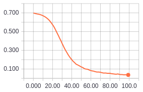

<table align="right">
  <tr>
    <td><b>Author:</b></td>
    <td>Jason Perlow</td>
  </tr>
</table>

 

----------

## Agni: A simple front vs side x-ray classification model

    
    <figcaption style="font-size: 9pt">The Hindu deity Agni: One of the guardian deities of direction (<i>wikimedia commons</i>)</figcaption>

Deep learning has been used extensively to automatically process and classify medical scans. As a contribution to this field we open-source Agni, a simple yet accurate model that automatically determines if a given patient x-ray is facing forwards (frontal) or sideways (lateral).

# Data

As data we use the open [Montgomery County chest x-ray database](http://archive.nlm.nih.gov/repos/chestImages.php). Since this data doesn't have patient orientation information we manually labeled a subset of the data yielding 149 frontal and 101 lateral images. To allow for a neural network with fewer parameters we rescaled x-rays to 128x128 px. Since we have few training samples we synthesised more the data by randomly rotating images in the range of -5 degrees to +5 degrees, shifting them by 0.05 % alonf thier hirzontal and vertical axes as well as flipping them along their vertical axis.

    
    <figcaption style="font-size: 9pt">Sample x-rays from the Mongomery dataset</figcaption>

# How it works

## Architecture

Convolutional neural networks (convnets) are a deep learning technique that use a hierarchy of filter banks to extract visual features as an input for a classifier. Structurally Agni is a convnet with four convolutional layers and two dense affine layers. In particular our architecture is based on the widely used VGG model where each model "block" has two convolutional layers with the same number of filters followed a pooling (downsampling) layer. We also use [batch normalization](https://arxiv.org/abs/1502.03167) between layers to allow us to be less careful about initialisation and improve training speed. Agni also includes dropout in the last affine layer to regularise parameters to reduce over-fitting.

## Training

To find weights that extract good features, weights are iteratively adjusted such that Agni best predicts the orientation of a given x-ray and orientation label pair. The extent to which a prediction is correct is measured using a loss function. Since our problem has two classes (frontal and lateral), we use binary cross-entropy loss. To adjust weights such that loss is minimised we use [Adam](https://arxiv.org/abs/1412.6980), a modern gradient descent optimiser.

We visualise the training process using [tensorboard](https://www.tensorflow.org/get_started/summaries_and_tensorboard). 100 iterations/epochs of training were sufficient for our model to converge to a near zero valuation loss:

  
  Valuation accuracy over 100 iterations.

  
  Valuation loss over 100 iterations

Note that Agni has a nice steadily decreasing validation loss curve without many upward jumps. Our model took about 35 mins on a quad core CPU so our experiments can be replicated by anyone with access to modern consumer grade hardware.

# Performance

## Experimental results

Our model achieves a 0% false positive rate and 100% true positive rate in the test set of 50 images. On test data Agni achieved a loss of 0.019.

Here is a confusion matrix of front vs side classifications:

<table align="center" style="width:75%;font-size: 11pt">
<caption style="font-size: 9pt">Confusion matrix</caption>
<tr>
  <th></th>
  <th>
<b>True frontal</b>
</th>
  <th>
<b>True lateral</b>
</th>
</tr>
<tr>
  <td>
<b>Predicted frontal</b>
</td>
  <td>
50
</td>
  <td>
0
</td>
</tr>
<tr>
  <td>
<b>Predicted lateral</b>
</td>
  <td>
0
</td>
  <td>
1
</td>
</tr>
</table>

## Comparison to related work

Previous work on front vs. side x-ray detection by [Rajkomar et al.](https://www.ncbi.nlm.nih.gov/pmc/articles/PMC5267603/) used pretrained models to achive near perfect accuracy. Our work is therefore comparable to previous work but is much simpler. Our model uses a total of 6 layers and a total of around 650 k parameters compared to previous work using Googlenet which uses 22 layers and a total of 6.7 M parameters. Agni is therefore both more memory and computationally efficient previous approaches.

# Code

Our repo is arranged into source (`src`) and data (`data`) folders. The `src` folder has two files, one for training (`train_Agni.py`) and another for testing (`test_Agni.py`). Our code is writen in python using the Keras 2 deep learning framework. Please refer to the `README.md` file in the repo for further details.

# Future work

Feel free to mess around with our parameters. See if you can delete some layers to make the model even simpler.

This project can easily be modified to become an arbitrary binary medical scan classifier (PET scan slides, MRIs slides, ...). Feel free to fork this project and classify your own data!

# Follow Us

<!-- display the social media buttons in your README -->
[![alt text][1.1]][1]
[![alt text][2.1]][2]
[![alt text][3.1]][3]

<!-- links to social media icons -->
<!-- no need to change these -->

<!-- icons with padding -->
[1.1]: http://i.imgur.com/tXSoThF.png (twitter icon with padding)
[2.1]: http://i.imgur.com/P3YfQoD.png (facebook icon with padding)
[3.1]: http://i.imgur.com/0o48UoR.png (github icon with padding)

<!-- links to your social media accounts -->
<!-- update these accordingly -->

[1]: https://twitter.com/isaziconsulting
[2]: https://www.facebook.com/Isazi-Consulting-240193656434498/
[3]: https://github.com/isaziconsulting
